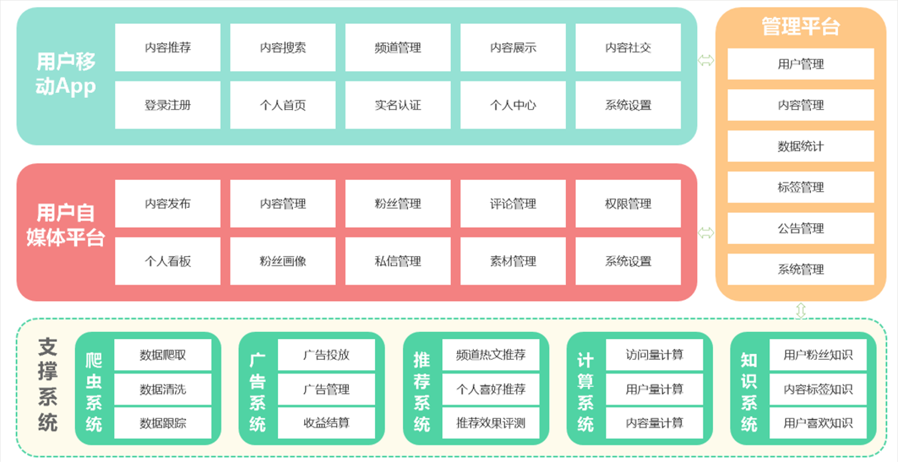
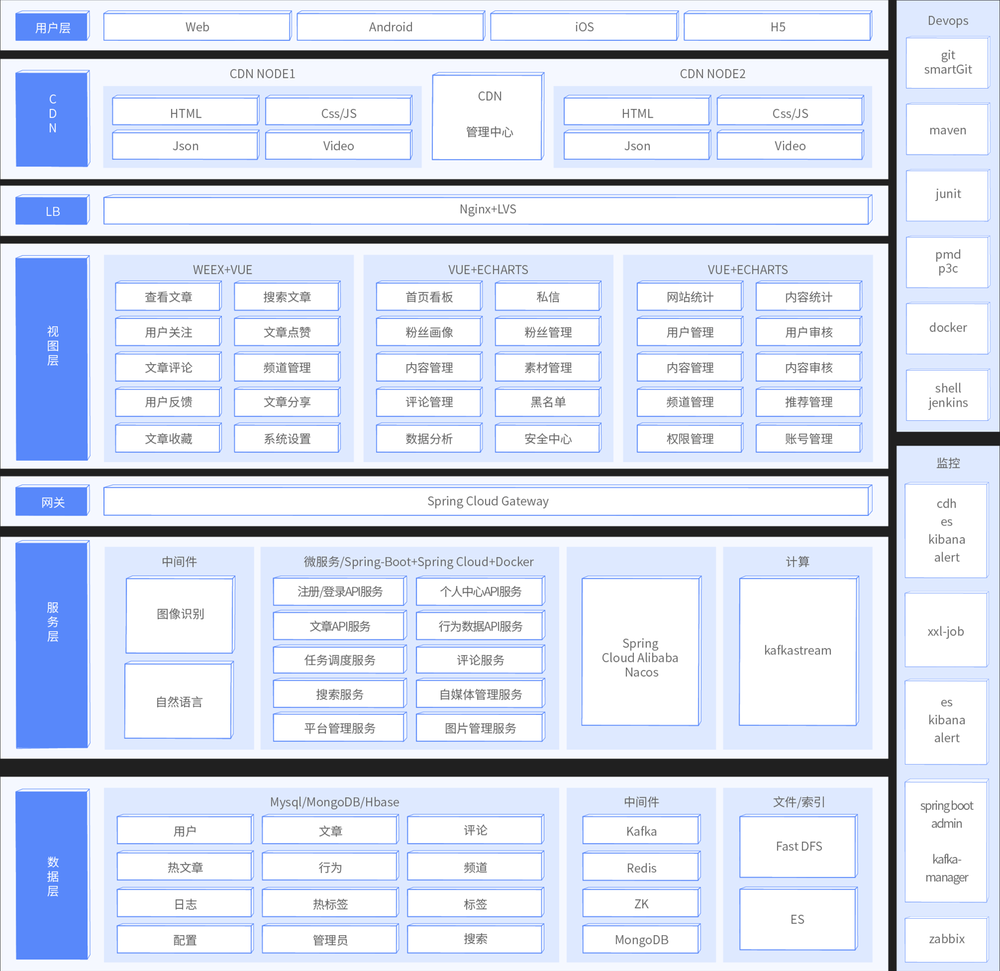

# heima-leadnews

##   介绍：   ###
项目名：Dark horse headlines  
#1、项目背景
  随着智能手机的普及，人们更加习惯于通过手机来看新闻。由于生活节奏的加快，
  很多人只能利用碎片时间来获取信息，因此，对于移动**资讯**客户端的需求也
  越来越高。黑马头条项目正是在这样背景下开发出来。黑马头条项目采用当下火
  热的微服务+大数据技术架构实现。本项目主要着手于获取最新最热新闻资讯，通
  过大数据分析用户喜好精确推送咨询新闻  

#2、项目概述
黑马头条项目是一个文章咨询平台。碎片化、切换频繁、社交化和个性化现如今成为
人们阅读行为的标签。黑马头条对海量信息进行搜集，通过系统计算分类，分析用户
的兴趣进行推送从而满足用户的需求。

#3、项目术语定义
- 项目：泛指黑马头条整个项目或某一项目模块
- 工程：泛指黑马头条某一项目的源码工程

- 用户：泛指黑马头条APP用户端用户
- 自媒体人：泛指通过黑马自媒体系统发送文章的用户
- 管理员（运营）：泛指黑马头条管理系统的使用用户

- App：泛指黑马头条APP
- WeMedia：泛指黑马头条自媒体系统
- Admin：泛指黑马头条管理系统

# 4、 软件架构
软件架构说明
  

# 5、技术架构图

- Spring-Cloud-Gateway : 微服务之前架设的网关服务，实现服务注册中的API请求路由，以及控制流速控制和熔断处理都是常用的架构手段，而这些功能Gateway天然支持

- 运用Spring Boot快速开发框架，构建项目工程；并结合Spring Cloud全家桶技术，实现后端个人中心、自媒体、管理中心等微服务。

- 运用Spring Cloud Alibaba Nacos作为项目中的注册中心和配置中心

  > 代替Euraka、Config

- 运用mybatis-plus作为持久层提升开发效率

- 运用Kafka完成内部系统消息通知；与客户端系统消息通知；以及实时数据计算

- 运用Redis缓存技术，实现热数据的计算，提升系统性能指标

- 使用Mysql存储用户数据，以保证上层数据查询的高性能

- 使用Mongo存储用户热数据，以保证用户热数据高扩展和高性能指标

- 使用MinIO作为静态资源存储器，在其上实现热静态资源缓存、淘汰等功能

- 运用Hbase技术，存储系统中的冷数据，保证系统数据的可靠性

- 运用ES搜索技术，对冷数据、文章数据建立索引，以保证冷数据、文章查询性能

- 运用AI技术，来完成系统自动化功能，以提升效率及节省成本。比如实名认证自动化

- PMD&P3C : 静态代码扫描工具，在项目中扫描项目代码，检查异常点、优化点、代码规范等，为开发团队提供规范统一，提升项目代码质量

# 6、APP主要功能大纲
- 频道栏：用户可以通过此功能添加自己感兴趣的频道，在添加标签时，系统可依据用户喜好进行推荐
- 文章列表：需要显示文章标题、文章图片、评论数等信息，且需要监控文章是否在APP端展现的行为

- 搜索文章：联想用户想搜索的内容，并记录用户的历史搜索信息
- 个人中心：用户可以在其个人中心查看收藏、关注的人、以及系统设置等功能
- 查看文章：用户点击文章进入查看文章页面，在此页面上可进行点赞、评论、不喜欢、分享等操作；除此之外还需要收集用户查看文章的时间，是否看我等行为信息

- 实名认证：用户可以进行身份证认证和实名认证，实名认证之后即可成为自媒体人，在平台上发布文章
- 注册登录：登录时，验证内容为手机号登录/注册，通过手机号验证码进行登录/注册，首次登录用户自动注册账号。

#  7、自媒体端功能大纲
- 内容管理：自媒体用户管理文章页面，可以根据条件进行筛选，文章包含草稿、已发布、未通过、已撤回状态。用户可以对文章进行修改，上/下架操作、查看文章状态等操作
- 评论管理：管理文章评论页面，显示用户已发布的全部文章，可以查看文章总评论数和粉丝评论数，可以对文章进行关闭评论等操作

- 素材管理：管理自媒体文章发布的图片，便于用户发布带有多张图片的文章

- 图文数据：自媒体人发布文章的数据：阅读数、评论数、收藏了、转发量，用户可以查看对应文章的阅读数据
- 粉丝画像：内容包括：粉丝性别分布、粉丝年龄分布、粉丝终端分布、粉丝喜欢分类分布

# 8、平台管理端功能大纲

- 用户管理：系统后台用来维护用户信息，可以对用户进行增删改查操作，对于违规用户可以进行冻结操
- 用户审核：管理员审核用户信息页面，用户审核分为身份审核和实名审核，身份审核是对用户的身份信息进行审核，包括但不限于工作信息、资质信息、经历信息等；实名认证是对用户实名身份进行认证

- 内容管理：管理员查询现有文章，并对文章进行新增、删除、修改、置顶等操作
- 内容审核：管理员审核自媒体人发布的内容，包括但不限于文章文字、图片、敏感信息等
- 频道管理：管理频道分类界面，可以新增频道，查看频道，新增或修改频道关联的标签
- 网站统计：统计内容包括：日活用户、访问量、新增用户、访问量趋势、热门搜索、用户地区分布等数据
- 内容统计：统计内容包括：文章采集量、发布量、阅读量、阅读时间、评论量、转发量、图片量等数据
- 权限管理：超级管理员对后台管理员账号进行新增或删除角色操作

# 9、演示网址
https://pip.itcast.cn/black

# 10、用到的技术
Linux系统：
1.nacos ： http://192.168.66.133:8848/nacos    nacos/nacos
2.mysql ：
3.minio:  http://192.168.66.133:9000           minio/minio123
4:gateway:

window系统：
1:nginx:   http://localhost:8801 /8802

# 11、使用说明

1.  xxxx
2.  xxxx
3.  xxxx

#### 12、参与贡献者

1.  JZC

#### 特技

1.  使用 Readme\_XXX.md 来支持不同的语言，例如 Readme\_en.md, Readme\_zh.md
2.  Gitee 官方博客 [blog.gitee.com](https://blog.gitee.com)
3.  你可以 [https://gitee.com/explore](https://gitee.com/explore) 这个地址来了解 Gitee 上的优秀开源项目
4.  [GVP](https://gitee.com/gvp) 全称是 Gitee 最有价值开源项目，是综合评定出的优秀开源项目
5.  Gitee 官方提供的使用手册 [https://gitee.com/help](https://gitee.com/help)
6.  Gitee 封面人物是一档用来展示 Gitee 会员风采的栏目 [https://gitee.com/gitee-stars/](https://gitee.com/gitee-stars/)

